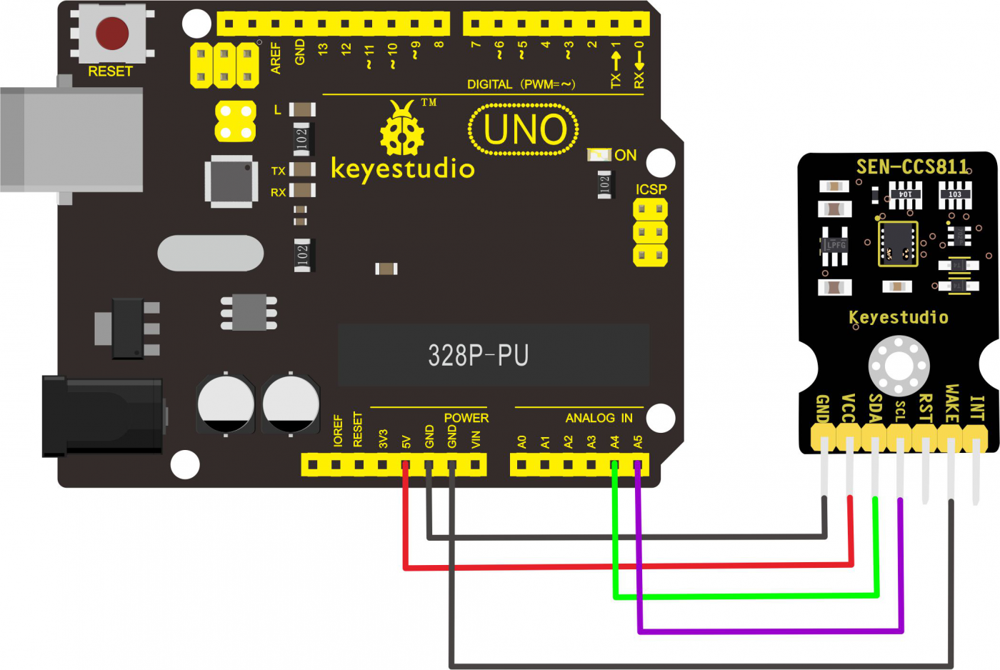

I recently wanted to introduce my daughters to the programming, so I decided
to use some kind of sensor to prototype a small application and teach them
how to make hardware and software work in tandem as I believe having something
physical would be more interesting than me typing on a REPL.

Now, I knew a raspberry pi had a way to connect sensors using its [General-purpose
input/output][1] pins, so I decided to build a non-trivial application to 
get used to the programming model and at the same time have experience to build 
something more complex later.

## Hardware Required

To start the project I did some research for sensors and while there were quite a
bit of choices, I got interested in the [KeyEstudio CCS811 Carbon Dioxide/ Air Quality 
Sensor for Arduino][2] which is compatible with Raspberry Pi 5V pins. It also works 
using the [I²C communication bus][3] which is also supported.

Now, in order to prototype faster, I got a [T-type breakout, a solderless board, and
rainbow cable, plus jump wires][4]. With this at hand, I was able to start interfacing 
the GPIO with the sensor.

## Wiring It All Together

Now, it was a while (since my college days) that I had work on a solderless board but
fortunately there is a diagram to connect the sensor to an arduino board thus you
can deduce how to wire it to the equivalent pins on a Raspberry Pi.

[1]: (https://en.wikipedia.org/wiki/General-purpose_input/output
[2]: https://www.keyestudio.com/keyestudio-ccs811-carbon-dioxide-temperature-air-quality-sensor-for-arduino-p0581.html
[3]: https://en.wikipedia.org/wiki/I%C2%B2C
[4]: https://www.amazon.com/gp/product/B07DL25MVQ/ref=ppx_yo_dt_b_asin_title_o05_s02?ie=UTF8&psc=1