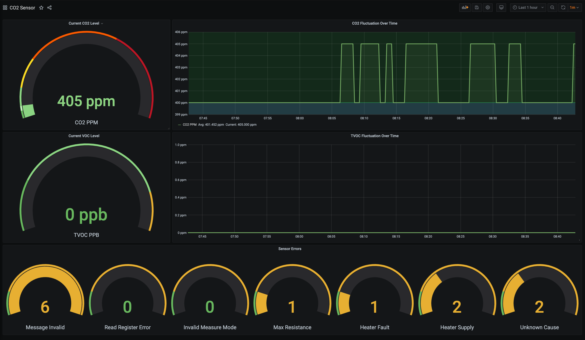

I recently wanted to introduce my daughters to programming, so I decided
to use some kind of sensor to prototype a small application and teach them
how to make hardware and software work in tandem as I believe having something
physical would be more interesting than me typing on a REPL.

Now, I knew a raspberry pi had a way to connect sensors using its [General-purpose
input/output][1] pins, so I decided to build a non-trivial application to 
get used to the programming model and at the same time have experience to build 
something more complex later.

## Hardware Required

To start the project I did some research for sensors and while there were quite a
bit of choices, I got interested in the [KeyEstudio CCS811 Carbon Dioxide/ Air Quality 
Sensor for Arduino][2] which is compatible with Raspberry Pi 5V pins. It also works 
using the [I²C communication bus][3] which is also supported.

Now, in order to prototype faster, I got a [T-type breakout, a solderless board, and
rainbow cable, plus jump wires][4]. With this at hand, I was able to start interfacing 
the GPIO with the sensor.

## Wiring It All Together

Now, it was a while (since my college days) that I had work on a solderless board but
fortunately there is a diagram to connect the sensor to an arduino board thus you
can deduce how to wire it to the equivalent pins on a Raspberry Pi.


With this diagram, and the official Raspberry Pi documentation, I was able to find the
correct pins without much issue. For reference, here is the Raspberry Pi GPIO pin
diagram (this is for Raspberry Pi 4 Model B).


Finally, with the help of the T-type breakout, and the solderless board, here is a picture
of the connections. Note that the breakout already labels the pins so is not hard
to match them.


## Validate Connections To Raspberry Pi with i2cdetect

Now, with everything wired, the fastest way to detect if the sensor is properly interfacing
to the I²C bus is to run a utility which can be installed on the Raspberry Pi Os named
[`i2cdetect`][5]. Here is the command:

```shell script

pi@elderserver:~ $ i2cdetect -y 1
     0  1  2  3  4  5  6  7  8  9  a  b  c  d  e  f
00:          -- -- -- -- -- -- -- -- -- -- -- -- --
10: -- -- -- -- -- -- -- -- -- -- -- -- -- -- -- --
20: -- -- -- -- -- -- -- -- -- -- -- -- -- -- -- --
30: -- -- -- -- -- -- -- -- -- -- -- -- -- -- -- --
40: -- -- -- -- -- -- -- -- -- -- -- -- -- -- -- --
50: -- -- -- -- -- -- -- -- -- -- 5a -- -- -- -- --
60: -- -- -- -- -- -- -- -- -- -- -- -- -- -- -- --
70: -- -- -- -- -- -- -- --

```

The way to interpret the output of the command, and the parameters is the following:

*  `i2cdetect` takes a positional argument named I²C bus, in this case it maps to a
    linux device by number depending on your board. On the Raspberry Pi 4, it is the
    device number 1 located at `/dev/i2c-1`. The `-y` option is to disable the interactive
    mode.

*  The output of command represents the bus addresses in which the detected components
   can be found. In this case, the only address responding is `5a`, which matches the
   vendor specified address for the CO2 sensor. You can find more details in the
   datasheet of the [CCS811 sensor][6].
   
> All I²C transactions must use the (7 bits) slave address 0x5A or 0x5B depending on 
> status of ADDR pin when writing to and reading from the CCS811.

## Read Data From The Sensor

This was the tricky part of the project as the documentation in the [wiki of the seller][7]
had mostly C code which somehow was factually incorrect once I compared it to the
[official programming and interface guide][8]. I struggled about a day using the wiki, so
I finally started to search for the sensor documentation instead of Arduino IDE examples.

### TypeScript, I²C And Prometheus

> The full source code can be found in this [Github repository.][9]

In order to work with I²C sensor I decided to use the help of the Node ecosystem using a
small library called [`raspi-i2c`][10] which allows sending and reading from devices
attached to the bus in a very procedural way, with sync and async functions.

To build the web service itself I used Express to handle the HTTP requests coming from
Prometheus and a small library called [`node-exporter-prometheus`][11] to generate the Gauge
metric type to expose the sensor data.

## Programming The Web Service

### The Express Server

An Express web service is not really that difficult, the relevant part is here:

```javascript
const app = express();

app.use(promExporter.middleware);
app.use(readSensorMiddleware(i2c));
app.get('/metrics', promExporter.metrics);

app.listen(serverPort, () => {
    initSensor(i2c);
    console.log(`server started at http://localhost:${serverPort}`);
});
```

We basically create an Express application, then register a middleware to gather the
common metrics using `node-exporter-prometheus` and register our own middleware to read
the sensor before finally exposing an endpoint under `/metrics`.

### Initializing The Sensor, A Quick Premier Of I²C

The `initSensor` function will apply the initialization logic required for the
sensor to start reading the environmental data. It follows the following diagram:


For this, the `raspi-i2c` library provides two basic methods to interact with the
I²C sensor:

1. `writeSync(address: int, register: int, buffer: Buffer): void` this method allows
    writing to I²C devices by their addressed, to a specific register.

1. `readSync(address: int, register: int, length: int): Buffer` this method allows
    reading a specific register of I²C devices by their address.
    
These are the two methods required to initialize the sensor. As it can be inferred,
the I²C sensor is very simple to interact with. As long as you have the sensor
address (in our case `5a`), and a register to read/write from, you will be able to
initialize and read the required data.

 This small snippet allows to read the hardware id from the sensor and check is the
 correct one:
 
 ```javascript
// SENSOR_ADDRESS is 0x5a, HARDWARE_ID_REGISTER is 0x20
const hardwareIdBuffer = i2c.readSync(SENSOR_ADDRESS, HARDWARE_ID_REGISTER, 1);
const hardwareId = hardwareIdBuffer[0];

if (hardwareId !== SENSOR_HARDWARE_ID_MAGIC_NUMBER) { // This is 0x81
    console.log("Hardware ID did not match: ", hardwareId);
    // ... call error handler
}
```

As you can see, this is very straightforward. You choose either if you want to read
or write from a sensor and how many bytes. You pass a [Buffer][12] or get one
depending on the operation. After that is just a matter of inspecting the bytes
returned according to the [datasheet][6].

### Read Data From The Sensor

Finally, the `readSensorMiddleware` will read both the CO2 and TVOC readings from the
sensor data address and set the Prometheus Gauges along any errors found. Here is
the relevant snippet of code:

```javascript
// SENSOR_ADDRESS is 0x5a, STATUS_REGISTER is 0x00
const statusRegisterReading = i2c.readSync(SENSOR_ADDRESS, STATUS_REGISTER, 1);
// bit at position 4 signals new data is ready
const isDataReady = bitwise.integer.getBit(statusRegisterReading[0], 4);

// If data is not ready check errors
if (isDataReady === 0) {
    checkErrorRegister(i2c);
    return;
}

// Read Data, 8 bytes, the first two bytes have the co2 reading
const buffer = i2c.readSync(SENSOR_ADDRESS, RESULT_DATA_REGISTER, 8);

// Convert the first two bytes to a 16 bit integer with big endianess
const co2Reading = buffer.readUInt16BE();

// Set the Prometheus Gauge to the result
co2Gauge.set(co2Reading);
```

## Endpoint Result And Grafana

Now, with everything wired together, here is the resulting payload
when sending an HTTP request (omitting comments and other metrics).

```shell script
$ http --body GET http://192.168.1.20:8080/metrics
co2_ppm{appName="co2-sensor-pi"} 405
tvoc_ppb{appName="co2-sensor-pi"} 0
message_invalid_errors{appName="co2-sensor-pi"} 6
read_reg_invalid_errors{appName="co2-sensor-pi"} 0
meas_mode_invalid_errors{appName="co2-sensor-pi"} 0
max_resistance_errors{appName="co2-sensor-pi"} 1
heater_fault_errors{appName="co2-sensor-pi"} 1
heater_supply_errors{appName="co2-sensor-pi"} 2
unknown_errors{appName="co2-sensor-pi"} 2
```

Once we have Prometheus scrapping the metrics, here is the resulting
Grafana dashboard:




[1]: (https://en.wikipedia.org/wiki/General-purpose_input/output
[2]: https://www.keyestudio.com/keyestudio-ccs811-carbon-dioxide-temperature-air-quality-sensor-for-arduino-p0581.html
[3]: https://en.wikipedia.org/wiki/I%C2%B2C
[4]: https://www.amazon.com/gp/product/B07DL25MVQ/ref=ppx_yo_dt_b_asin_title_o05_s02?ie=UTF8&psc=1
[5]: https://linux.die.net/man/8/i2cdetect
[6]: https://cdn.sparkfun.com/assets/learn_tutorials/1/4/3/CCS811_Datasheet-DS000459.pdf
[7]: https://wiki.keyestudio.com/KS0457_keyestudio_CCS811_Carbon_Dioxide_Air_Quality_Sensor
[8]: https://www.sciosense.com/wp-content/uploads/2020/01/CCS811-Application-Note-Programming-and-interfacing-guide.pdf
[9]: https://github.com/ElderMael/co2-sensor-pi
[10]: https://www.npmjs.com/package/raspi-i2c
[11]: https://www.npmjs.com/package/@tailorbrands/node-exporter-prometheus
[12]: https://nodejs.org/api/buffer.html